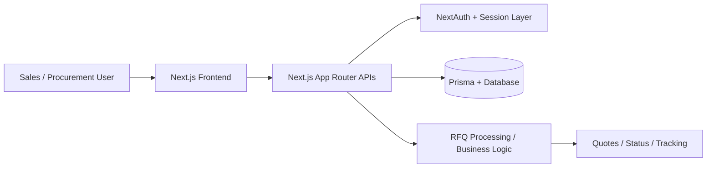
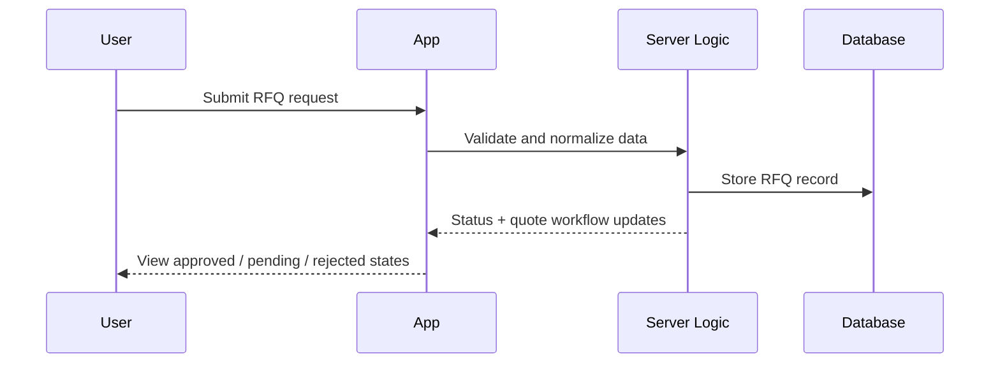

# RFQ Automation

RFQ Automation is a modern, full-stack app for managing the Request for Quote lifecycle — from intake and validation to quote generation and tracking.

## Why this project
- Centralizes RFQ requests in one workflow
- Speeds up quote preparation and team collaboration
- Uses a secure authentication layer and database-backed workflow
- Built with Next.js + Prisma for a scalable product foundation

## Architecture



## Core workflow



## Features
- Secure sign-in with NextAuth
- Prisma-powered data model
- Modern React + Tailwind interface
- Structured RFQ lifecycle and status tracking
- Ready for further automation and analytics

## Stack
- Next.js
- React
- TypeScript
- Prisma
- PostgreSQL-compatible database
- Tailwind CSS
- NextAuth

## Quick start

```bash
git clone https://github.com/anuragkaushik00/RFQ_Automation-.git
cd RFQ_Automation-/rfq-app
npm install
npm run db:push
npm run dev
```

Then open http://localhost:3000

## Project layout

```text
rfq-app/
├── app/          # Routes and UI pages
├── components/   # Reusable UI components
├── lib/          # Helpers and utilities
├── prisma/       # Database schema and seed logic
├── public/       # Static assets
├── auth.ts       # Auth configuration
├── package.json   # Scripts and dependencies
└── README.md     # App-level docs
```

## Roadmap
- Quote templates and automation rules
- Approval workflow and audit trail
- Analytics dashboard
- Export and integration APIs

This README is intentionally short; for deeper implementation details, see the app-level docs in `rfq-app/README.md`.